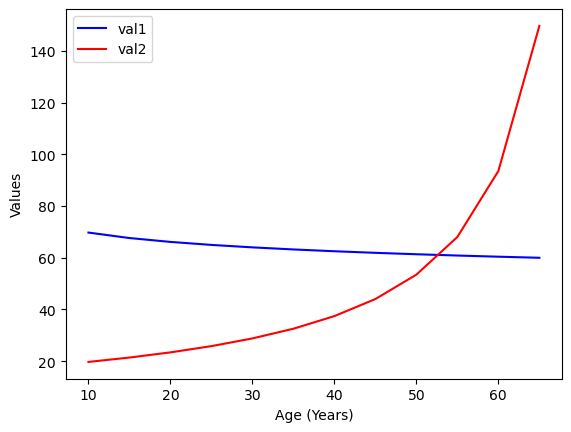

# What is this experiment about?
This is an experiment to compare models to see their ability to write codes that can find curve intersection. The sample data is given below.
The age is the independent variable, while val1 and val2 are some dependent variables.
We are interested in finding the intersection of the two curves. 

The values of the arrays are given below. 

```python
ages = [10, 15, 20, 25, 30, 35, 40, 45, 50, 55, 60, 65]

val1 = [69.76183509, 67.64873998, 66.14947514, 64.98655499, 64.03638003,
    63.23301856, 62.53711519, 61.92328492, 61.37419504, 60.87748282,
    60.42402009, 60.00687481
]
val2 = [
    19.70254308, 21.39133249, 23.39676991, 25.81712542, 28.79602451,
    32.5520277,  37.43483186, 44.04097866, 53.47833123, 68.06333066,
    93.58707965, 149.73932744
]
```
# Data Visualization
Visualising the above data as shown below indicates that the two lines intersect at around 52 years.
But we need to get a more accurate value and we need to do this programmatically



# Prompt
The following prompt was used to generate the code.

*i have an age array in steps of 5 years. I have val1 array of same shape as age with float valuesthat is generally decreasing in value with time. I have val2 array  that is generally increasing with time. Write me a python code to find the interpolated value of age where val1 = val2
The curve is linear between any two values, but on the whole its not likely linear. Also I need the age value precise upto a year not decade*
```python
ages = [10, 15, 20, 25, 30, 35, 40, 45, 50, 55, 60, 65]

val1 = [69.76183509, 67.64873998, 66.14947514, 64.98655499, 64.03638003,
    63.23301856, 62.53711519, 61.92328492, 61.37419504, 60.87748282,
    60.42402009, 60.00687481
]
val2 = [
    19.70254308, 21.39133249, 23.39676991, 25.81712542, 28.79602451,
    32.5520277,  37.43483186, 44.04097866, 53.47833123, 68.06333066,
    93.58707965, 149.73932744
]
```

# Outputs
## Claude
Here is the code written by Claude
```python
import numpy as np
from scipy import interpolate

def find_intersection_age(ages, val1, val2):
    # Create interpolation functions for both val1 and val2
    f1 = interpolate.interp1d(ages, val1, kind='linear')
    f2 = interpolate.interp1d(ages, val2, kind='linear')
    
    # Create a fine-grained age array for searching
    fine_ages = np.linspace(min(ages), max(ages), 1000)
    
    # Interpolate values for the fine-grained ages
    fine_val1 = f1(fine_ages)
    fine_val2 = f2(fine_ages)
    
    # Find the index where the difference between val1 and val2 is closest to zero
    diff = np.abs(fine_val1 - fine_val2)
    intersection_index = np.argmin(diff)
    
    # Return the precise age at the intersection
    return fine_ages[intersection_index]
```

## ChatGPT - O1
```python
def find_intersection_ages(ages, val1, val2):
    """
    Returns a list of ages at which val1 equals val2, assuming piecewise
    linear behavior between consecutive points.
    """
    intersection_ages = []
    
    for i in range(len(ages) - 1):
        x0, x1 = ages[i], ages[i+1]
        # val1 endpoints on this segment
        y1_0, y1_1 = val1[i], val1[i+1]
        # val2 endpoints on this segment
        y2_0, y2_1 = val2[i], val2[i+1]
        
        # Slopes in the segment
        slope1 = (y1_1 - y1_0) / (x1 - x0)
        slope2 = (y2_1 - y2_0) / (x1 - x0)
        
        # If slopes are almost identical, either no intersection or infinitely many
        # if the lines are exactly the same. We skip in that simple approach.
        if abs(slope1 - slope2) < 1e-12:
            continue  # no unique intersection in this segment
        
        # Solve y1_0 + slope1*(x - x0) = y2_0 + slope2*(x - x0)
        # => slope1*(x - x0) - slope2*(x - x0) = (y2_0 - y1_0)
        # => (slope1 - slope2)*(x - x0) = (y2_0 - y1_0)
        # => x = x0 + (y2_0 - y1_0) / (slope1 - slope2)
        x_intersect = x0 + (y2_0 - y1_0) / (slope1 - slope2)
        
        # Check if intersection is within this age segment
        if x0 <= x_intersect <= x1:
            intersection_ages.append(x_intersect)
    
    return intersection_ages
```

## Deepseek - R1
```python
def find_interpolated_age(ages, val1, val2):
    """
    Finds the interpolated age where val1 equals val2 using linear interpolation.

    Args:
        ages (list): List of ages.
        val1 (list): List of values for the first dataset.
        val2 (list): List of values for the second dataset.

    Returns:
        float or None: The interpolated age where val1 equals val2, or None if no intersection is found.
    """
    for i in range(len(ages) - 1):
        current_age = ages[i]
        next_age = ages[i + 1]
        current_v1 = val1[i]
        next_v1 = val1[i + 1]
        current_v2 = val2[i]
        next_v2 = val2[i + 1]

        # Calculate the denominator for the interpolation formula
        denominator = (next_v1 - current_v1) - (next_v2 - current_v2)
        if denominator == 0:
            continue  # Lines are parallel, no intersection

        # Calculate the interpolation parameter t
        t = (current_v2 - current_v1) / denominator

        # Check if the intersection occurs within the current interval
        if 0 <= t <= 1:
            age_interpolated = current_age + t * (next_age - current_age)
            return age_interpolated

    return None  # No intersection found
```
